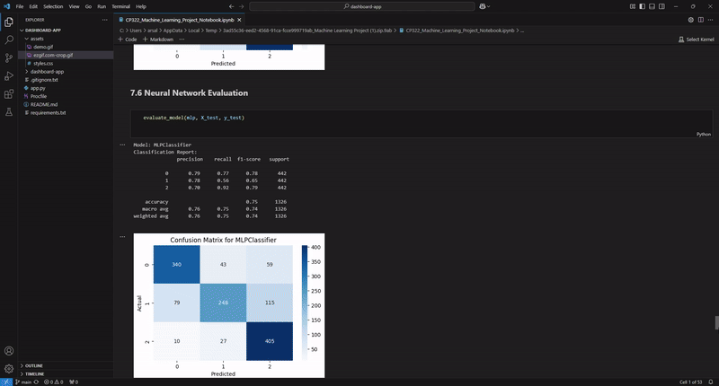

# **CP322 Machine Learning Project**  
**Title:** Predicting Students' Dropout and Academic Success  
**Project Team:** Arsalan Khan *(210862640)* & Aliha Ali *(210184090)*   
**Dataset:** Predict Students' Dropout and Academic Success  
**Due Date:** December 13th, 2024  

---

## **Introduction**  

In higher education, identifying students at risk of dropout is a critical challenge. Early intervention can significantly improve academic success rates, reduce student attrition, and support institutional decision-making. The dataset chosen for this project, *"Predict Students' Dropout and Academic Success,"* originates from a Portuguese higher education institution and includes comprehensive data about students' academic performance, demographics, and socioeconomic factors.

The primary objective of this project is to **predict student outcomes**—whether they will **drop out**, remain **enrolled**, or successfully **graduate**—by leveraging machine learning techniques. This problem is framed as a **multi-class classification task** with three categories:

- **Dropout (0)**  
- **Enrolled (1)**  
- **Graduate (2)**  

---

### **Key Project Goals**  

1. Cleaning and preprocessing the dataset to ensure it is ready for analysis.  
2. Performing **Exploratory Data Analysis (EDA)** to identify feature relationships and trends.  
3. Addressing **class imbalance** to ensure fair model predictions.  
4. Building and evaluating machine learning models, including:  
   - Logistic Regression  
   - Decision Tree  
   - Random Forest  
   - Support Vector Machine (SVM)  
   - Neural Networks  
5. Drawing data-driven conclusions and providing actionable insights to reduce student dropout rates and improve academic outcomes.  

---

### **Project Demonstration**

The GIF above highlights the project's workflow, including data preprocessing, EDA, and model evaluation.

---

## **Table of Contents**  

1. **Import Libraries and Load Data**  
2. **Data Exploration and Preprocessing**  
   - 2.1 Inspect the Data  
   - 2.2 Handle Missing Values  
   - 2.3 Encode Categorical Variables  
   - 2.4 Feature Scaling  
3. **Exploratory Data Analysis (EDA)**  
   - 3.1 Univariate Analysis  
   - 3.2 Bivariate Analysis  
   - 3.3 Feature Relationships  
4. **Handling Class Imbalance**  
   - 4.1 Analyze Class Distribution  
   - 4.2 Resampling Techniques  
5. **Feature Engineering and Selection**  
   - 5.1 Feature Importance  
6. **Model Building**  
   - 6.1 Split the Data  
   - 6.2 Basic Models  
     - 6.2.1 Logistic Regression  
     - 6.2.2 Decision Tree  
   - 6.3 Advanced Models  
     - 6.3.1 Random Forest  
     - 6.3.2 Support Vector Machine  
     - 6.3.3 Neural Network  
7. **Model Evaluation**  
   - 7.1 Evaluate Models  
   - 7.2 Model Evaluations  
8. **Hyperparameter Tuning**  
   - 8.1 Grid Search for Random Forest  
   - 8.2 Evaluate Tuned Random Forest  
9. **Conclusion**  

---

## **1. Import Libraries and Load Data**

...

---

## **Future Work**  
1. **Hyperparameter Tuning for Other Models:** Extend grid search and optimization for models like SVM and Neural Networks.  
2. **Feature Engineering:** Introduce new features, such as progression rates and cumulative performance metrics, to improve predictive accuracy.  
3. **Advanced Models:** Implement ensemble techniques such as XGBoost, LightGBM, or stacking methods to further enhance results.  
4. **Interpretability:** Use explainability tools like SHAP or LIME to gain deeper insights into model predictions and their real-world implications.  
5. **Early Prediction:** Focus on early-semester data to identify at-risk students sooner for timely interventions.

---

## **Project Team**  
- **Arsalan Khan** *(210862640)*  
- **Aliha Ali** *(210184090)*  

---

## **References**  
1. Mónica V. Martins, Daniel Tolledo, Jorge Machado, Luís M. T. Baptista, and Valentim Realinho (2021). *Early prediction of student's performance in higher education: A case study*. Published in Trends and Applications in Information Systems and Technologies.  
2. UCI Machine Learning Repository: [Predict Students' Dropout and Academic Success Dataset](https://archive.ics.uci.edu/dataset/697/predict+students+dropout+and+academic+success).  

---
